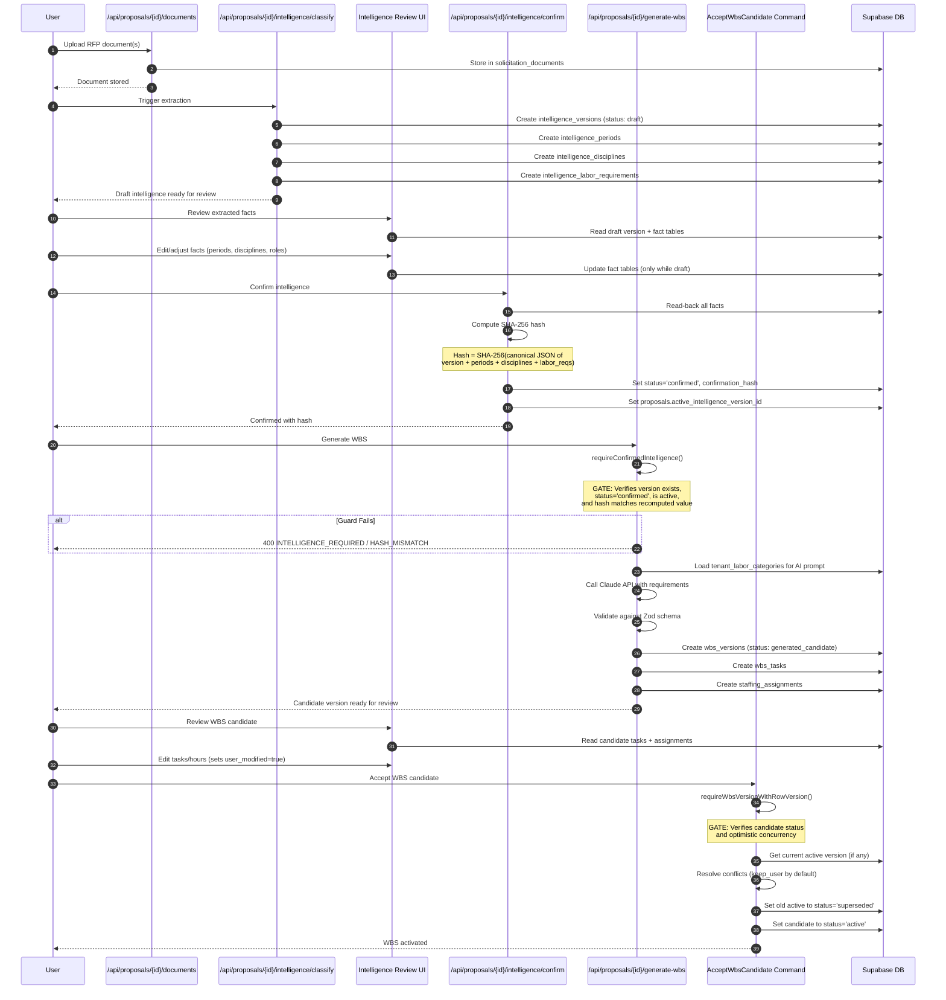
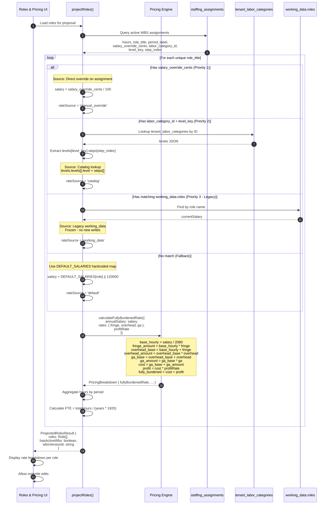
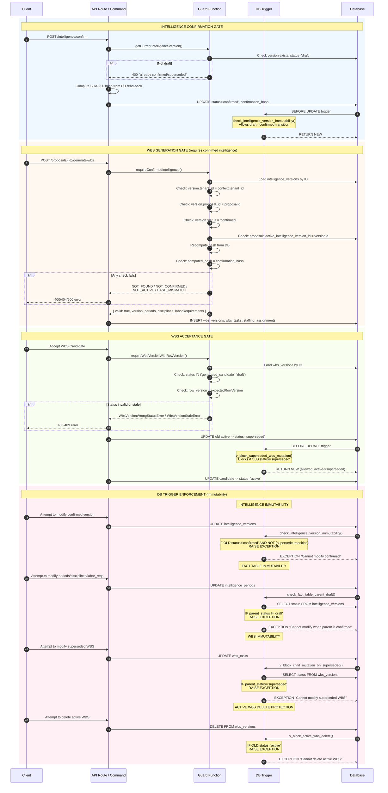

# TrueBid Sequence Flows

Generated as of commit 18a69b409e9f6afe65e67bbe404ab8cca5d4e958 on 2026-07-12

This document contains three Mermaid sequence diagrams illustrating the critical data flows in TrueBid's proposal intelligence and pricing systems.

---

## 1. Intelligence to WBS Flow

Shows the complete pipeline from document upload through WBS acceptance, highlighting gate enforcement points where `requireConfirmedIntelligence` guards the flow.



---

## 2. Pricing Resolution Path

Shows how salary is resolved from multiple sources in priority order: assignment override, tenant catalog lookup, and legacy fallback.



**Salary Resolution Priority:**

| Priority | Source | Field Path | Notes |
|----------|--------|------------|-------|
| 1 | Assignment Override | `staffing_assignments.salary_override_cents` | User manually set |
| 2 | Catalog Lookup | `tenant_labor_categories.levels[level][step]` | Phase 5 migration |
| 3 | Legacy Fallback | `working_data.roles[].currentSalary` | Frozen, no new writes |
| 4 | Hardcoded Default | `DEFAULT_SALARIES[role]` | Last resort |

---

## 3. Gate Enforcement Points

Shows every location where `requireConfirmedIntelligence`, WBS guards, or DB triggers stand between a request and a write operation.



---

## Gate Summary Table

| Gate | Location | Function/Trigger | Enforces |
|------|----------|------------------|----------|
| Intelligence Confirmation | `POST /intelligence/confirm` | Command layer | Draft -> Confirmed transition with hash |
| WBS Generation | `POST /generate-wbs` | `requireConfirmedIntelligence()` | Confirmed + active + hash verified |
| WBS Acceptance | `AcceptWbsCandidate` | `requireWbsVersionWithRowVersion()` | Status + optimistic concurrency |
| Intelligence Immutability | DB Trigger | `check_intelligence_version_immutability()` | Blocks confirmed/superseded mutations |
| Fact Table Immutability | DB Trigger | `check_fact_table_parent_draft()` | Blocks when parent not draft |
| WBS Superseded Immutability | DB Trigger | `v_block_superseded_wbs_mutation()` | Blocks all superseded mutations |
| WBS Task/Assignment Immutability | DB Trigger | `v_block_child_mutation_on_superseded()` | Cascades immutability to children |
| Active WBS Delete Protection | DB Trigger | `v_block_active_wbs_delete()` | Must supersede before delete |

---

## Hash Verification Flow

The `requireConfirmedIntelligence` guard performs cryptographic verification:

```
1. Load intelligence_versions row
2. Verify: tenant_id, proposal_id, status='confirmed'
3. Verify: is active version for proposal
4. Call loadAndHashIntelligence():
   a. Load periods, disciplines, labor_requirements
   b. Coerce all rows to canonical form
   c. Build CoercedIntelligenceVersion object
   d. canonicalize() -> sorted JSON string
   e. SHA-256 hash
5. Compare computed hash to stored confirmation_hash
6. On mismatch: return HASH_MISMATCH (indicates tampering)
```

This ensures that WBS generation only proceeds when the intelligence data is exactly as it was when confirmed, providing an audit trail and preventing data corruption.
